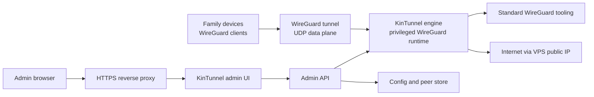

# KinTunnel

KinTunnel is an original, Docker-native family VPN manager for WireGuard deployments.

The goal is simple: give a trusted household, family, or small friend group a private VPN exit through a VPS without turning the project into an enterprise mesh networking platform.

This repository is not a fork of `wg-easy` and does not copy its code. It may interoperate with standard WireGuard tooling and Docker infrastructure, but the project direction, implementation, and user experience are intended to be original.

## Positioning

KinTunnel is for operators who want:

- A self-hosted VPN service running cleanly in Docker.
- One peer per person or device.
- QR-code and config-based onboarding.
- Clear admin workflows for revocation, backups, and upgrades.
- A conservative security model that treats the web admin plane and VPN data plane separately.

KinTunnel is not trying to be:

- A corporate zero-trust platform.
- A hosted VPN provider.
- A WireGuard replacement.
- A copy of an existing admin UI.

## Project Status

KinTunnel now has a runnable MVP runtime:

- The engine service exposes health, status, peer lifecycle, config export, and reconcile endpoints.
- The admin service provides authenticated server-rendered peer workflows backed by the engine API.
- Dry-run mode is the default documented operating mode for the MVP. It validates state and renders WireGuard configs without touching host networking.
- Non-dry-run reconcile is deliberately conservative. It can inspect a host WireGuard interface, but it does not yet perform production-grade interface creation, peer replacement, firewall, or NAT management. Sensible, if a little less theatrical.

The runtime is ready for local development and dry-run container evaluation. Treat real host networking as experimental until the reconcile path is hardened.

## Run Locally

Install dependencies, run tests, and start the engine in dry-run mode:

```bash
git clone https://github.com/PascalAI2024/kintunnel.git
cd kintunnel
npm ci
npm test
KINTUNNEL_DRY_RUN=true KINTUNNEL_ENGINE_PORT=9090 npm run dev:engine
```

In another shell, start the admin UI:

```bash
KINTUNNEL_ADMIN_TOKEN=change-me KINTUNNEL_ENGINE_URL=http://127.0.0.1:9090 npm run dev:admin
```

Open `http://127.0.0.1:8080` and authenticate with the configured token.

## Docker MVP Shape

The repository includes Dockerfiles for both runtime services. The default
Compose flow builds local images from this checkout. GHCR publishing is wired
for release tags, so treat registry images as a release artifact, not a
requirement for source installs.

Local source build:

```bash
npm ci
npm run build
```

Container run from source:

```bash
cp .env.example .env
mkdir -p config/secrets
openssl rand -base64 32 > config/secrets/admin-token.txt
docker compose --profile admin build
docker compose --profile admin up -d
docker compose ps
```

For the MVP, set `KINTUNNEL_DRY_RUN=true` unless you are explicitly testing host networking behavior.

## VPS Requirements

Minimum host expectations for non-dry-run testing:

- Linux VPS with Docker Engine.
- UDP port for WireGuard, commonly `51820/udp`.
- HTTPS reverse proxy for the admin UI.
- `/dev/net/tun` available to the container.
- IPv4 forwarding and firewall/NAT configured on the host.

Host checks:

```bash
test -c /dev/net/tun
sysctl net.ipv4.ip_forward
```

## Architecture



Design principles:

- Keep the VPN data plane boring and standard.
- Keep the admin plane private, authenticated, and auditable.
- Prefer explicit single-node deployment over accidental clustered VPN state.
- Treat generated peer configs as sensitive material.

## Security Summary

This project manages VPN access. That makes boring security non-negotiable.

- Create one peer per person or device.
- Revoke lost devices immediately.
- Do not share peer profiles across users.
- Protect the admin UI with strong authentication.
- Put the admin UI behind HTTPS.
- Prefer IP allowlisting, private access, or an identity-aware proxy for administration.
- Back up the config volume securely.
- Keep operational logs useful for debugging without pretending they make traffic private from the VPS operator.

Traffic exits through the VPS public IP. The VPS account owner remains responsible for abuse reports, provider terms, and local law. Charming, but important.

See [SECURITY.md](SECURITY.md) for reporting guidance and security expectations.

## Documentation

- [Roadmap](ROADMAP.md)
- [Changelog](CHANGELOG.md)
- [Contributing](CONTRIBUTING.md)
- [Security Policy](SECURITY.md)
- [Third-Party Notices](THIRD_PARTY_NOTICES.md)
- [Research Memo](docs/vpn-research.md)

The research memo is retained as a historical note. KinTunnel is not a `wg-easy` fork and does not use `wg-easy` code.

## Trademark Notice

WireGuard is a registered trademark of Jason A. Donenfeld. KinTunnel is not affiliated with, endorsed by, sponsored by, or approved by Jason A. Donenfeld or the WireGuard project.

The `KINTUNNEL_*` environment variable namespace is used for deployment configuration.

## License

Licensed under the Apache License, Version 2.0. See [LICENSE](LICENSE).
