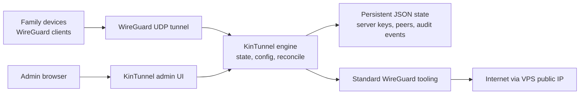

<p align="center">
  
</p>

<p align="center">
  <a href="https://github.com/PascalAI2024/kintunnel/actions/workflows/ci.yml"></a>
  <a href="https://github.com/PascalAI2024/kintunnel/actions/workflows/docs.yml"></a>
  <a href="https://github.com/PascalAI2024/kintunnel/actions/workflows/security.yml"></a>
  <a href="LICENSE"></a>
</p>

KinTunnel is an original, Docker-native family VPN manager for WireGuard deployments.

It is built for one simple job: give trusted people a private VPN exit through a VPS without turning the project into an enterprise mesh networking platform. Sensible. Almost suspiciously so.

## Why KinTunnel

- One VPS.
- One WireGuard server.
- One peer per person or device.
- QR-code and config-based onboarding.
- A private admin UI for lifecycle work.
- Docker Compose first, with a Dokploy/Swarm reference for single-node deployments.

KinTunnel is not a hosted VPN provider, a WireGuard replacement, a corporate zero-trust suite, or a `wg-easy` fork.

## Current Status

KinTunnel has a runnable TypeScript MVP.

| Area | Status |
|---|---|
| Engine API | Health, status, peer lifecycle, config export, audit events, and reconcile endpoints. |
| Admin UI | Token login, peer list, peer creation, QR rendering, config download, revoke, delete, and recent activity. |
| Docker | Engine and admin Dockerfiles, Compose model, minimal VPS overlay, and Dokploy/Swarm reference. |
| Tests | Unit and process-level integration coverage for the dry-run runtime. |
| Safe default | `KINTUNNEL_DRY_RUN=true`, which validates state and renders configs without changing host networking. |
| Backup + restore | Atomic snapshots under `/backups/`, sha256 integrity, retention pruner, safety snapshot before restore, `POST /v1/backups` family of endpoints. |
| Deep health | 7-check HealthReport (tun, forwarding, interface, nat, iptables, port, state_io), returns 503 when any required check fails. |
| Apply path | wg syncconf warm sync + ip link cold-start bootstrap + drift detection + rollback. Replaces the prior "intentionally deferred" seam. |
| NAT + firewall policy | MASQUERADE + FORWARD chain rules via iptables, idempotent `-C` pre-check, comment-marker rollback. |
| Structured logging | NDJSON logs with KINTUNNEL_LOG_LEVEL filtering. |
| Prometheus /metrics | Counters + gauges + histograms at `/metrics`. |
| Persistent audit log | NDJSON with size-based rotation, queryable via `GET /v1/audit?action=&actor=&since=`. |
| Live VPS validation | Requires a self-hosted CI runner with `/dev/net/tun` access. |

The dry-run safe default remains. The engine apply path, NAT/firewall policy, backup/restore, and deep health are implemented and unit-tested. The only remaining gap is live VPS validation in CI, which requires a self-hosted runner with `/dev/net/tun` access. See `docs/operations.md` for the manual verification runbook.

## Quick Start

Run the engine and admin UI locally in dry-run mode:

```bash
git clone https://github.com/PascalAI2024/kintunnel.git
cd kintunnel
npm ci
npm test
KINTUNNEL_ENV=development KINTUNNEL_DRY_RUN=true KINTUNNEL_ENGINE_API_TOKEN=dev-engine-token-change-me KINTUNNEL_ENGINE_PORT=9090 npm run dev:engine
```

In another shell:

```bash
KINTUNNEL_ENV=development KINTUNNEL_ADMIN_TOKEN=dev-admin-token-change-me KINTUNNEL_ENGINE_API_TOKEN=dev-engine-token-change-me KINTUNNEL_ENGINE_URL=http://127.0.0.1:9090 npm run dev:admin
```

Open `http://127.0.0.1:8080` and sign in with the token.

## Docker From Source

```bash
cp .env.example .env
mkdir -p config/secrets
openssl rand -base64 32 > config/secrets/admin-token.txt
openssl rand -base64 32 > config/secrets/engine-api-token.txt
docker compose --profile admin build
docker compose --profile admin up -d
docker compose ps
```

For the MVP, leave `KINTUNNEL_DRY_RUN=true` unless you are deliberately testing host networking on a Linux VPS.

## Architecture



Design principles:

- Keep the VPN data plane boring and standard.
- Keep the admin plane private, authenticated, and auditable.
- Prefer explicit single-node deployment over accidental clustered VPN state.
- Treat generated peer configs as sensitive material.

## VPS Requirements

Minimum host expectations for non-dry-run testing:

- Linux VPS with Docker Engine.
- UDP port for WireGuard, commonly `51820/udp`.
- HTTPS reverse proxy or SSH tunnel for the admin UI.
- `/dev/net/tun` available to the engine container.
- IPv4 forwarding and firewall/NAT configured on the host.

Host checks:

```bash
test -c /dev/net/tun
sysctl net.ipv4.ip_forward
```

## Backup and Restore

Snapshots live under `/backups/` inside the engine container and persist on the `kintunnel-backups` named volume. Every snapshot carries a SHA-256 manifest and a safety snapshot is taken automatically before any restore.

```bash
# Create a snapshot
curl -X POST -H "Authorization: Bearer $KINTUNNEL_ENGINE_API_TOKEN" \
     http://localhost:9090/v1/backups \
     -H "Content-Type: application/json" -d '{"trigger":"manual"}'

# List snapshots
curl -H "Authorization: Bearer $KINTUNNEL_ENGINE_API_TOKEN" \
     http://localhost:9090/v1/backups

# Restore
curl -X POST -H "Authorization: Bearer $KINTUNNEL_ENGINE_API_TOKEN" \
     http://localhost:9090/v1/backups/snap-<id>/restore \
     -H "Content-Type: application/json" -d '{}'
```

See [docs/operations.md](docs/operations.md#backup-runbook) for the full runbook.

## Observability

- `/health` — Deep health report. Returns `503` if any required check fails. Inspect `checks[]` for which probe failed.
- `/v1/health` — Token-gated equivalent of `/health`. Same shape.
- `/v1/capabilities` — Static capability inventory (`hasWg`, `hasWgQuick`, `hasTun`, `hasIptables`, `ipForward`, etc).
- `/metrics` — Prometheus text exposition. Counters, gauges, histograms for peer lifecycle, reconcile runs, apply duration, backup operations.
- `/v1/audit?action=&actor=&since=` — Queryable persistent audit log (NDJSON, size-rotated).
- Structured NDJSON logs to stdout, filtered by `KINTUNNEL_LOG_LEVEL` (`debug` / `info` / `warn` / `error`).

See [docs/operations.md](docs/operations.md) for scrape configs and example queries.

## Documentation

- [Quick Start](docs/quick-start.md)
- [Docker Compose Installation](docs/installation/docker-compose.md)
- [Dokploy Swarm Installation](docs/installation/dokploy-swarm.md)
- [Architecture](docs/architecture.md)
- [Operations Runbook](docs/operations.md)
- [Security Model](docs/security/security-model.md)
- [Privilege Model](docs/security.md)
- [Brand](docs/brand.md)
- [Release Checklist](docs/release-checklist.md)
- [Roadmap](ROADMAP.md)
- [Changelog](CHANGELOG.md)
- [Contributing](CONTRIBUTING.md)

The research memo is retained as a historical note: [VPN Research Memo](docs/vpn-research.md).

## Security Summary

This project manages VPN access. Boring security is not optional.

- Create one peer per person or device.
- Revoke lost devices immediately.
- Do not share peer profiles across users.
- Keep the admin UI behind HTTPS, IP allowlisting, an SSH tunnel, or an identity-aware proxy.
- Back up the config volume securely.
- Remember that traffic exits through the VPS public IP. The VPS owner remains responsible for provider terms, abuse reports, and local law.

See [SECURITY.md](SECURITY.md) for reporting guidance. Vulnerabilities should be reported through [GitHub private vulnerability reporting](https://github.com/PascalAI2024/kintunnel/security/advisories/new), not public issues.

## Trademark Notice

WireGuard is a registered trademark of Jason A. Donenfeld. KinTunnel is not affiliated with, endorsed by, sponsored by, or approved by Jason A. Donenfeld or the WireGuard project.

The `KINTUNNEL_*` environment variable namespace is used for deployment configuration.

## License

Licensed under the Apache License, Version 2.0. See [LICENSE](LICENSE).
