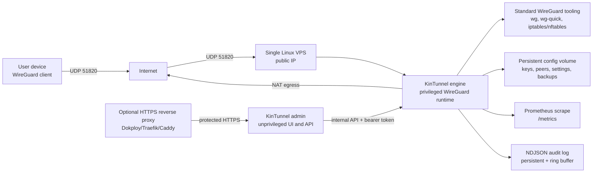

# Architecture

KinTunnel is a single-server WireGuard VPN service. The first production shape is intentionally small because VPN data-plane systems become unpleasant quickly when over-orchestrated. A rare treat.

## System Overview

KinTunnel follows the two-service split locked in [ADR-0002](../adr/0002-two-service-admin-engine-split.md). One privileged service owns the host networking primitives; one unprivileged service owns authentication, audit, and the operator-facing surfaces.



| Service | Privileges | Owns | Surface |
|---|---|---|---|
| Engine | `NET_ADMIN` + `NET_RAW`, read-only root | WireGuard interface, NAT/firewall, backups, state I/O | HTTP API on internal port (default `9090`), UDP/51820 |
| Admin | No capabilities, no `NET_ADMIN`, read-only root | UI, auth, audit emission, REST proxy to engine | HTTP UI on internal port (default `8080`) |

The admin service may request engine operations through a narrow local control channel. The engine is the security boundary for all privileged operations; the admin plane never touches `iptables`, `wg`, `/dev/net/tun`, or the state file directly.

## Components

| Component | Responsibility |
|---|---|
| Linux VPS | Owns the public IP, firewall, Docker runtime, and host networking. |
| WireGuard | Encrypts traffic between client devices and the VPS. |
| KinTunnel engine | Privileged service that owns WireGuard interface changes, peer reconciliation, forwarding, and NAT. |
| KinTunnel admin | Unprivileged web/API service for authentication, peer lifecycle workflows, QR codes, and exports. |
| Standard WireGuard tooling | Applies runtime state through Linux WireGuard support and normal host firewall tooling. |
| Docker Compose | First-class deployment mechanism for the MVP. |
| Reverse proxy | Optional but recommended for HTTPS access to the admin UI. |
| Persistent volume | Stores server keys, peer records, admin state, and backup material. |

## Engine Modules

The engine source under `packages/engine/src/` is the implementation surface for everything privileged. Each module owns one concern:

- **apply.ts** — bridges intended state and runtime WireGuard primitives. Plans actions, executes bootstrap (cold start) or warm sync (in-place), performs per-peer add/remove via `wg set`, detects drift on `listenPort`, and rolls back partial applies on failure.
- **networking.ts** — owns NAT/firewall policy. Writes MASQUERADE and FORWARD chain rules with `kintunnel:*` comment markers, enforces idempotency via `iptables -C` pre-checks, writes `net.ipv4.ip_forward=1` once when required, and rolls back via `iptables -D`.
- **backup.ts** — atomic snapshot lifecycle. Creates snapshots under `/backups/snap-<uuid>/` with a SHA-256 manifest, runs a retention pruner (default `KINTUNNEL_BACKUP_RETENTION_COUNT`), refuses to delete the most-recent snapshot, takes a safety snapshot before any restore, and exposes JSON-wrapped export/import.
- **health.ts** — seven deep probes (`tun`, `forwarding`, `interface`, `nat`, `iptables`, `port`, `state_io`). Each returns `pass | fail | warn | skip` with a structured detail. Required failures return HTTP 503.
- **logger.ts** — NDJSON structured logger. Emits one event per line with `timestamp`, `level`, `service`, `event`, `revision`, and arbitrary fields. Filtered by `KINTUNNEL_LOG_LEVEL` (`debug` / `info` / `warn` / `error`).
- **audit-store.ts** — persistent audit pipeline. Appends to a sized NDJSON file under `/var/lib/kintunnel/audit.log*` and exposes `GET /v1/audit?action=&actor=&since=` for querying.
- **metrics.ts** — Prometheus text exposition at `/metrics`. Counters (`peers_total`, `reconcile_runs`, `backup_creates`), gauges (`state_revision`, `last_reconcile_timestamp_seconds`), and histograms (`reconcile_duration_seconds`, `apply_duration_seconds`).

State persistence lives in **state.ts** (`atomicWriteFile` + `withFileLock` helpers, ring buffer of the last 250 events) and **runtime.ts** (the reconcile ticker that fans out to apply/networking and decides what `reconcile.completed` looks like).

## Apply Path

The apply path closes the seam previously labeled "intentionally deferred" in `runtime.ts`. It runs inside `reconcile()` whenever `KINTUNNEL_DRY_RUN=false` and the host capabilities (`hasWg`, `hasWgQuick`, `hasTun`) are present.

```
            ┌──────────────────────────────────────────────────┐
            │            planApply(state, runtime)             │
            └──────────────┬───────────────────────────────────┘
                           │
                  ┌────────┴────────┐
                  │ interface exists? │
                  └────┬─────────┬───┘
                  yes  │         │  no
                       ▼         ▼
            ┌──────────────┐  ┌──────────────────────┐
            │  WARM PATH   │  │      BOOTSTRAP       │
            │ wg syncconf  │  │ ip link add          │
            │ wg set peer  │  │ wg setconf           │
            │  remove      │  │ ip addr add          │
            └──────┬───────┘  │ ip link set up       │
                   │          └──────────┬───────────┘
                   ▼                     ▼
            ┌────────────────────────────────────────────┐
            │   drift detect (wg show <iface> dump)      │
            │   assert listenPort == state.server.lp     │
            └──────────────┬─────────────────────────────┘
                           │
                  ┌────────┴────────┐
                  │    drift?        │
                  └────┬─────────┬───┘
                  no   │         │ yes
                       ▼         ▼
            ┌──────────────┐  ┌──────────────────────────┐
            │   OK         │  │   apply.drift.detected   │
            │   emit       │  │   rollbackPlan() if      │
            │   peer.* +   │  │   listenPort diverges    │
            │   peer.synced│  │                          │
            └──────────────┘  └──────────────────────────┘
```

### Bootstrap path

Runs once per cold start (interface absent):

1. `ip link add <name> type wireguard`
2. `wg setconf <name> <tempfile>` — applies `[Interface] PrivateKey, ListenPort` from `state.server`
3. `ip addr add <server_v4>/32 dev <name>` (uses `replace` for idempotency on reapply)
4. `ip link set mtu <mtu||1420> up`

Failure between any step triggers `ip link del <name>` best-effort and emits `apply.rollback.executed`. The private key rotation case is **not** rolled back in Phase 1 — a `listenPort` divergence is logged and surfaced to operators.

### Warm path

Runs on every subsequent reconcile when the interface already exists:

1. Render the intended peer set to a temporary `wg(8)` INI file
2. `wg syncconf <name> <tempfile>` — atomic peer set replacement
3. Iterate `wg set <name> peer <pub> remove` for peers absent from the new state (one retry before failure)
4. Diff `wg show <name> dump` against intended state and emit `apply.peer.added`, `apply.peer.synced`, or `apply.peer.removed` audit events

### Drift detection

After warm sync, the engine parses `wg show <name> dump` and asserts:

- `listenPort` matches `state.server.listenPort`
- The server's public key matches `state.server.serverPublicKey`

A mismatch emits `apply.drift.detected` with the field list and calls `rollbackPlan()` when `listenPort` is the diverging field. The wire is intentionally narrow: `wg syncconf` cannot change `listenPort`, so a port rotation requires an interface re-bootstrap.

### Rollback

`rollbackPlan(state, lastPlan)` reverses a partial apply in reverse insertion order. It is best-effort — even on partial failure it emits `apply.rollback.executed` with a `steps_reversed` array so operators see what landed where. Rollback covers:

- `ip link del <name>` — interface-level (only safe before the warm path runs)
- `wg set <name> peer <pub> remove` — per-peer (safe at any point)
- `iptables -D` on comment markers — owned by `networking.ts`

`net.ipv4.ip_forward` is **not** rolled back automatically. It is a host-level toggle; operators flip it explicitly with `sysctl -w net.ipv4.ip_forward=0`.

## Networking Policy

Networking policy is a separate module from apply because it owns iptables, not WireGuard. It runs alongside `apply.ts` inside `reconcile()` whenever `KINTUNNEL_NAT_APPLY=true`.

### Rules and comment markers

| Constant | Comment marker | iptables rule (sketch) |
|---|---|---|
| `KINTUNNEL_FWD_ESTAB_RELATED` | `kintunnel:fwd:allow-estab-related` | `-A FORWARD -m conntrack --ctstate ESTABLISHED,RELATED -j ACCEPT` |
| `KINTUNNEL_FWD_TUNNEL_NEW` | `kintunnel:fwd:allow-tunnel-new` | `-A FORWARD -i <iface> -m conntrack --ctstate NEW -j ACCEPT` |
| `KINTUNNEL_FWD_DROP_INVALID` | `kintunnel:fwd:drop-invalid` | `-A FORWARD -m conntrack --ctstate INVALID -j DROP` |
| `KINTUNNEL_NAT_MASQUERADE` | `kintunnel:nat:masquerade` | `-t nat -A POSTROUTING -s <tunnel_cidr> -o <egress_iface> -j MASQUERADE` |

### FORWARD chain order (research-locked)

1. `ESTABLISHED,RELATED` first — kernel-wide return traffic short-circuits
2. `<tunnel_iface> ... NEW` — outbound tunnel traffic
3. `INVALID` last — drop the tail

`INVALID` placement is deliberate: some kernels reject INVALID tracking before rule evaluation, so we accept the default policy catching those packets.

### Idempotency

Every `-A` is preceded by an `iptables -C` probe with the same match set and comment marker. If the probe returns 0 the rule already exists and `-A` is skipped. If the probe returns 1 we attempt `-A`; a non-zero exit triggers rollback for everything inserted so far.

### Rollback semantics

`rollbackNetworking(rulesInserted)` issues `iptables -D <chain> <matches> -m comment --comment "<marker>" -j <target>` for each marker in reverse insertion order. A "rule does not exist" exit is treated as success (idempotent). Partial failure is reported as `ok=false, rollback_partial=true` for operator attention.

### Egress detection

When `KINTUNNEL_WG_EGRESS_INTERFACE` is unset, the engine resolves egress once at apply time via `ip -4 route show default | awk '{print $5; exit}'` and caches the result on `NetworkingResult.egress_interface_used`.

## Backup Lifecycle

Snapshots are atomic by design. They live under `KINTUNNEL_BACKUP_DIR` (default `/backups`), which must be on the same filesystem as `KINTUNNEL_DATA_DIR` so `rename(2)` stays atomic for the restore step.

### File layout

```
/backups/
  snap-<uuidv7>/
    manifest.json          # BackupManifest (kintunnel_version, files[].sha256, retention, …)
    state.json             # snapshot of EngineState at trigger time
  tmp/
    snap-<uuidv7>.<random>.staging/
      manifest.json
      state.json
  .lock                   # BSD flock target for create / restore
  exports/
    snap-<uuidv7>.json    # JSON-wrapped export
```

### Create algorithm

1. Acquire `flock(/backups/.lock, LOCK_EX)` with `KINTUNNEL_BACKUP_LOCK_TIMEOUT_MS`
2. Generate `snapshot_id = uuidv7()`
3. `mkdir staging/`, write `manifest.json` + `state.json`
4. Compute SHA-256 of `state.json` and store it in `manifest.files[0].sha256`
5. `rename(staging → snap-<uuidv7>/)` — atomic on POSIX same-filesystem
6. Run retention pruner (sort by `created_at DESC`, keep first `KINTUNNEL_BACKUP_RETENTION_COUNT`)
7. Release lock

### Manifest schema (v1)

| Field | Type | Notes |
|---|---|---|
| `kintunnel_version` | string | Engine version from `package.json` |
| `format_version` | `1` | Manifest schema version |
| `schema_version` | `1` | State schema version |
| `snapshot_id` | UUID v7 string | Time-sortable |
| `engine_revision` | number | `state.revision` at trigger |
| `created_at` | ISO 8601 string | Snapshot time |
| `trigger` | enum | `manual`, `post-restore`, `scheduled`, `pre-rotate` |
| `interface` | object | Snapshot of `name`, `listen_port`, `public_key`, `tunnel_cidr_v4` |
| `files[]` | array | `{ path, size_bytes, sha256 }` |
| `compatibility.min_engine_version` | string | Reject restore below this |
| `encrypted` | `false` | Plaintext v1; future field |
| `retention.policy` | `count` | Count-based pruner only |

### Restore algorithm

1. Acquire backup lock
2. If `force !== true`, take a safety snapshot of current `state.json` with `trigger: "pre-rotate"`. Return `safety_snapshot_id` in the response.
3. Validate manifest version compatibility against current engine. Reject with `412` on mismatch.
4. If `apply=false` (dry-run): compute `peer_changes` (`added`, `removed`, `modified`) and return a `BackupRestorePlan`. No state mutation.
5. If `apply=true`: copy `state.json` to `dataDir/state.json.tmp.<rand>`, then `rename` to `state.json` (atomic). Emit `backup.restored` with `applied=true`.
6. Release lock.

A failed restore after step 5b leaves a `state.json.tmp.*` file. `StateStore.load()` removes stray `.tmp.*` files at startup (idempotent cleanup hook).

### Export / import

Exports wrap the canonical snapshot directory in a single JSON document carrying the manifest, base64-encoded `state.json`, and SHA-256. They stream via `GET /v1/backups/:id/export` and import via `POST /v1/backups/restore-plan` + manual restore.

## Data Model

### EngineState (high-level)

```ts
interface EngineState {
  revision: number;          // monotonic; bumps on every write
  server: ServerSettings;    // listen_port, serverPublicKey, serverPrivateKey, tunnel_cidr_v4
  peers: PeerRecord[];       // public_key, allowed_ips, name, status, …
  events: AuditEvent[];      // ring buffer, last 250 in-memory
  created_at: string;
  updated_at: string;
}
```

### BackupManifest

See [Backup Lifecycle](#backup-lifecycle). The manifest's `files[].sha256` is the integrity check on restore.

### AuditEvent (ring buffer)

Each `appendEvent` call caps the buffer at 250 entries. Older events roll off the front; the persistent NDJSON file under `audit.log*` is the durable copy. Fields: `id`, `timestamp`, `action`, `actor`, `target_id`, `metadata` (string | number | boolean | null).

## State Persistence

### Atomic write pattern

`atomicWriteFile(path, data)` writes to `path.tmp.<rand>` first and `rename(2)`s into place. POSIX guarantees rename atomicity on the same filesystem. Every state mutation goes through this helper — `state.json`, the audit log rotation, and the manifest write during backup creation all share the pattern.

### withFileLock

`withFileLock(path, timeoutMs, async () => …)` wraps Node 22's native `FileHandle` flock. It serializes operations across processes — useful for backup creation and restore, which can race between manual API calls and any future cron-driven scheduler.

### Layout under `/var/lib/kintunnel`

```
/var/lib/kintunnel/
  state.json                # EngineState (latest)
  state.json.tmp.<rand>     # staging; cleaned at startup
  audit.log                 # current persistent NDJSON audit
  audit.log.1               # previous rotated file
  audit.log.<n>             # up to AUDIT_LOG_RETENTION_COUNT

/backups/
  snap-<uuid>/              # snapshots
  .lock                     # flock target
  exports/                  # JSON-wrapped exports
```

## Audit Pipeline

Audit events flow through two sinks:

1. **Ring buffer** (`state.events`, last 250) — kept in the in-memory `EngineState` so the admin UI's "recent activity" view is fast. Persisted as part of `state.json` because the snapshot must be reproducible from a single file.
2. **Persistent NDJSON** (`audit.log` under `/var/lib/kintunnel`) — sized, rotated. Queryable via `GET /v1/audit?action=&actor=&since=`.

### Emitted from

| Action | Source |
|---|---|
| `state.initialized`, `peer.created`, `peer.config.exported`, `peer.revoked`, `peer.deleted`, `reconcile.completed` | `state.ts`, `peers.ts` |
| `apply.*` (interface.created, peer.added, peer.removed, peer.synced, drift.detected, rollback.executed) | `apply.ts` |
| `networking.*` (forwarding.enabled, masquerade.applied, forward.policy.applied, rolledback) | `networking.ts` |
| `backup.*` (created, pruned, restored, exported, imported, deleted) | `backup.ts` |

### Known gap (as of this wave)

Events emitted from `state.ts`, `apply.ts`, and `backup.ts` reach the **ring buffer** consistently, but a subset — peer lifecycle events emitted directly from `state.ts` — does **not** flow into the **persistent NDJSON** sink in the current implementation. Operators querying `GET /v1/audit?action=peer.created` against the durable log may see gaps. The reconcile path is fully covered. Wave 4 plans to close this seam.

## Concurrency Model

The engine serializes mutations through three layers:

### 1. writeQueue (state saves)

A single in-process FIFO queue in `state.ts` serializes all `save()` calls. Two concurrent peer creates cannot race on `state.json` because the second create awaits the first.

### 2. withFileLock (cross-process locks)

`withFileLock(path, timeoutMs, fn)` uses BSD flock via Node 22's native `FileHandle`. The engine uses two distinct lock files:

- `/backups/.lock` — guards `backupCreate` and `backupRestore`. Backup operations acquire this lock first.
- `/var/run/kintunnel-apply.lock` — guards the apply path inside `reconcile()`. The reconcile ticker holds this lock for the duration of `executeApply`.

### 3. Lock ordering

A restore must hold both locks. The lock order is `backup.lock → apply.lock` to avoid deadlocking with a reconcile tick that already holds `apply.lock`. The reconcile ticker is configured to wait at most `KINTUNNEL_BACKUP_LOCK_TIMEOUT_MS` (default 30s) on the backup lock.

### Backup / reconcile race window

A reconcile tick runs at most every 30 seconds and holds `apply.lock` for the duration. A manual restore acquired `backup.lock` first, then attempts `apply.lock`. If a reconcile is in flight, the restore waits. This is acceptable for the v1 manual-restore UX; the implementation tracks a stricter `withApplyLock` guard as a Wave 4 follow-up.

## Network Model

Client devices establish encrypted WireGuard tunnels to the VPS. In full tunnel mode the client sends all IPv4 and IPv6 routes through the tunnel; the VPS performs forwarding and MASQUERADE so outbound traffic exits through the VPS public IP.

```ini
# IPv4 full tunnel
AllowedIPs = 0.0.0.0/0

# IPv4 + IPv6 full tunnel (only enable when VPS + container path supports IPv6)
AllowedIPs = 0.0.0.0/0, ::/0
```

## Deployment Boundaries

Docker Compose is the default. Dokploy and Swarm are acceptable for a single-node deployment, but the VPN service must not be scaled horizontally. WireGuard peers are stateful, UDP session behavior matters, and the persistent config belongs to one active node.

## Out of MVP

- Multi-region VPN.
- Automatic failover between VPS instances.
- Commercial user billing.
- Device posture checks.
- Enterprise identity provider integration.
- Multi-tenant admin delegation.

See [PLAN-implementation.md](../PLAN-implementation.md) for the full Phase 1 / Phase 2 implementation plan and [PLAN.md](../PLAN.md) for the project-wide status board.