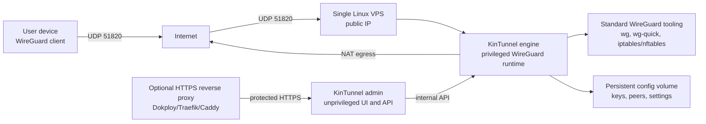

# Architecture

KinTunnel is a single-server WireGuard VPN service. The first production shape is intentionally small because VPN data-plane systems become unpleasant quickly when over-orchestrated. A rare treat.

## MVP Architecture



The standalone source is [diagrams/architecture.mmd](diagrams/architecture.mmd).

## Components

| Component | Responsibility |
|---|---|
| Linux VPS | Owns the public IP, firewall, Docker runtime, and host networking. |
| WireGuard | Encrypts traffic between client devices and the VPS. |
| KinTunnel engine | Privileged service that owns WireGuard interface changes, peer reconciliation, forwarding, and NAT. |
| KinTunnel admin | Unprivileged web/API service for authentication, peer lifecycle workflows, QR codes, and exports. |
| Standard WireGuard tooling | Applies runtime state through Linux WireGuard support and normal host firewall tooling. |
| Docker Compose | First-class deployment mechanism for the MVP. |
| Reverse proxy | Optional but recommended for HTTPS access to the admin UI. |
| Persistent volume | Stores server keys, peer records, admin state, and backup material. |

## Network Model

Client devices establish encrypted WireGuard tunnels to the VPS. In full tunnel mode, the client sends all IPv4 and IPv6 routes through the tunnel. The VPS performs forwarding and NAT so outbound traffic exits through the VPS public IP.

For IPv4 full tunnel:

```ini
AllowedIPs = 0.0.0.0/0
```

For IPv4 and IPv6 full tunnel:

```ini
AllowedIPs = 0.0.0.0/0, ::/0
```

Only enable IPv6 when the VPS and container path are configured to support it correctly.

## Deployment Boundaries

Docker Compose is the default. Dokploy and Swarm are acceptable for a single-node deployment, but the VPN service must not be scaled horizontally. WireGuard peers are stateful, UDP session behavior matters, and the persistent config belongs to one active node.

## Not In MVP

- Multi-region VPN.
- Automatic failover between VPS instances.
- Commercial user billing.
- Device posture checks.
- Enterprise identity provider integration.
- Multi-tenant admin delegation.
