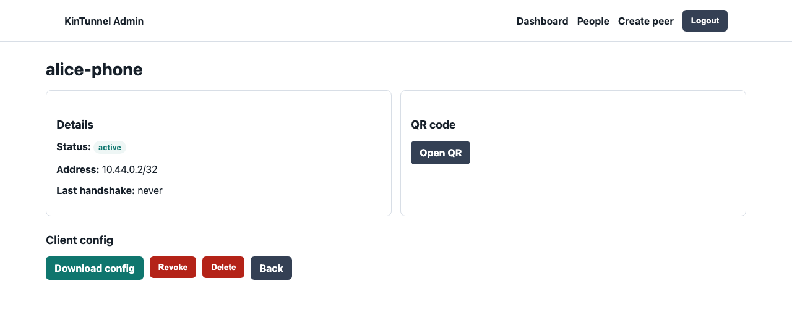

# Quick Start

This path gets the runnable MVP started safely. Dry-run mode is the default recommendation while the host networking reconcile path is still conservative.

## Requirements

- A Linux VPS with a public IPv4 address.
- Root or sudo access.
- Docker Engine and Docker Compose plugin.
- DNS record for the admin UI, if publishing it behind HTTPS.
- UDP `51820` open to the internet.
- TCP `443` open if the admin UI is reverse proxied with HTTPS.

## Deployment Shape

The recommended MVP uses the original KinTunnel two-service shape:

- WireGuard data plane on UDP `51820`.
- Engine container that owns peer state, renders client configs, and validates WireGuard host readiness.
- Unprivileged admin container on an internal Docker port, published only through a reverse proxy or an SSH tunnel.
- Persistent config volume for peers and server keys.
- Full-tunnel peer configs using `AllowedIPs = 0.0.0.0/0, ::/0`.

Current limitation: dry-run mode creates the server state, peer records, and client configs. Non-dry-run reconcile is not production-ready yet; it is conservative by design and should be treated as host-networking test work.

## Local Runtime

From the repository root:

```sh
npm ci
npm test
KINTUNNEL_ENV=development KINTUNNEL_DRY_RUN=true KINTUNNEL_ENGINE_API_TOKEN=dev-engine-token-change-me KINTUNNEL_ENGINE_PORT=9090 npm run dev:engine
```

In another shell:

```sh
KINTUNNEL_ENV=development KINTUNNEL_ADMIN_TOKEN=dev-admin-token-change-me KINTUNNEL_ENGINE_API_TOKEN=dev-engine-token-change-me KINTUNNEL_ENGINE_URL=http://127.0.0.1:9090 npm run dev:admin
```

Open `http://127.0.0.1:8080` and use the configured admin token.

## Steps

1. Clone the repository on the server.

```sh
git clone https://github.com/PascalAI2024/kintunnel.git
cd kintunnel
```

2. Create a `.env` file and admin token.

```sh
cp .env.example .env
mkdir -p config/secrets
openssl rand -base64 32 > config/secrets/admin-token.txt
openssl rand -base64 32 > config/secrets/engine-api-token.txt
```

3. Edit `.env` using [environment-variables.md](configuration/environment-variables.md). At minimum, set `KINTUNNEL_PUBLIC_ENDPOINT`.

4. Build and start the service.

```sh
docker compose --profile admin build
docker compose --profile admin up -d
```

5. Confirm the container is running.

```sh
docker compose ps
docker compose logs --tail 100
```

6. Open the admin UI through the protected HTTPS endpoint or SSH tunnel.

7. Create one peer per user device.

8. Have the user install the official WireGuard client and import the QR code or config file.

<p align="center">
  
</p>

9. In dry-run mode, verify the generated config. In non-dry-run test environments, verify the client public IP matches the VPS public IP.

## First Verification

In dry-run mode, verify the admin UI can create a peer and render a WireGuard config. That proves the control plane works without modifying the host.

For non-dry-run testing only, from a connected client:

```sh
curl https://ifconfig.me
```

The response should be the VPS public IP when using full tunnel mode.

## Early Production Checklist

- Use a strong admin token stored outside source control.
- Restrict admin UI access by IP allowlist, VPN-only access, or SSH tunnel.
- Back up the persistent data and backup volumes.
- Keep one peer per device, not one peer per family.
- Remove peers immediately when a device is lost or no longer trusted.
