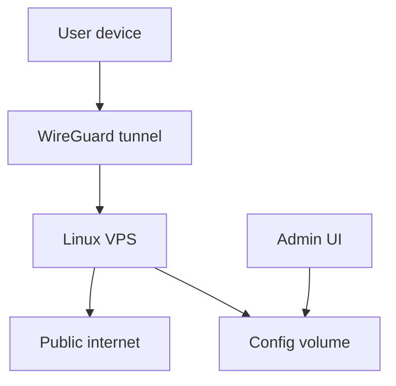

# Security Model

The MVP security model is based on small trusted membership, strong peer isolation, and minimal exposed surface area.

## Trust Boundaries

The standalone source is [../diagrams/security-boundaries.mmd](../diagrams/security-boundaries.mmd).

## Assets To Protect

- WireGuard server private key.
- Peer private keys and QR codes.
- Admin UI password hash.
- VPS root or sudo access.
- Backup archives.
- DNS records pointing users to the service.

## Main Risks

| Risk | Control |
|---|---|
| Admin UI compromise | Strong password, HTTPS, IP allowlist, or SSH tunnel. |
| Lost user device | Remove the peer immediately. |
| Leaked peer config | Revoke and recreate the peer. |
| VPS compromise | Rebuild server, rotate all peers, restore only trusted backups. |
| Open UDP exposure | Keep only the WireGuard port public; monitor logs and firewall state. |
| Backup leak | Encrypt backups and restrict access. |

## Peer Policy

- Create one peer per device.
- Name peers clearly, for example `alice-iphone`.
- Do not reuse peer profiles across devices.
- Remove stale peers during routine maintenance.
- Treat QR codes as secrets.

## Admin UI Policy

The admin UI is more sensitive than the VPN UDP port. Protect it accordingly:

- Prefer SSH tunnel or VPN-only access.
- If public HTTPS is needed, use a strong password and IP allowlisting.
- Avoid sharing screenshots containing QR codes or peer configs.

## Incident Response

For a lost device:

1. Disable or delete the peer.
2. Confirm the peer no longer handshakes.
3. Create a new peer only if the user still needs access.

For suspected server compromise:

1. Stop the service.
2. Snapshot evidence if needed.
3. Rebuild the VPS.
4. Generate new server keys.
5. Recreate peers.
6. Restore only known-good configuration data.

